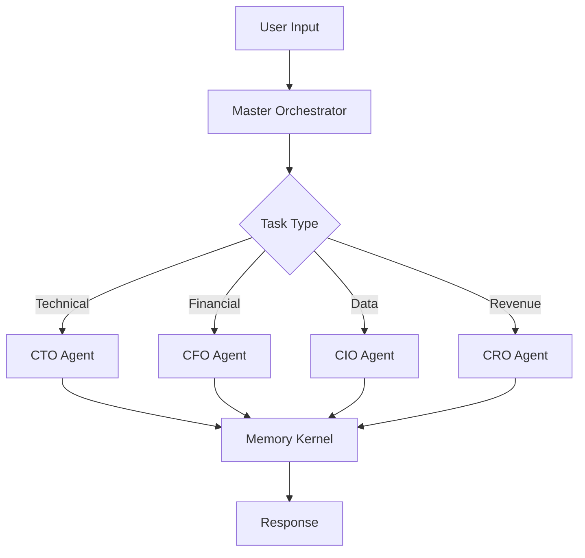

# Architecture Overview

EAOS is designed as a layered system with clear separation of concerns.

## System Layers

```
┌─────────────────────────────────────────────────────────────┐
│                    MASTER ORCHESTRATOR                       │
│              (Coordinates all agents & systems)              │
├─────────────────────────────────────────────────────────────┤
│  EXECUTIVE LAYER                                             │
│  CTO Agent • CFO Agent • CIO Agent • CRO Agent              │
├─────────────────────────────────────────────────────────────┤
│  CORE LAYER                                                  │
│  Memory Kernel • Human Decision Matrix • Autonomy Mode       │
├─────────────────────────────────────────────────────────────┤
│  MODULE LAYER                                                │
│  BEADS • Compliance • Audit • Release Train • PR Bot         │
└─────────────────────────────────────────────────────────────┘
```

## Master Orchestrator

The Master Orchestrator is the central coordination point for all EAOS operations:

- **Task Routing** - Directs tasks to appropriate agents
- **Multi-Agent Coordination** - Manages parallel agent operations
- **State Management** - Maintains system-wide state
- **Approval Workflow** - Enforces Human Decision Matrix

## Executive Layer

Specialized agents for different business domains:

| Agent | Domain | Responsibilities |
|-------|--------|-----------------|
| CTO | Technical | Architecture, code review, technical decisions |
| CFO | Financial | Budget, costs, financial analysis |
| CIO | Information | Data, security, infrastructure |
| CRO | Revenue | Sales, growth, customer success |

## Core Layer

Foundational system components:

- **Memory Kernel** - Persistent knowledge and reasoning graph
- **Human Decision Matrix** - Approval level enforcement
- **Autonomy Mode** - Self-operating capabilities with guardrails

## Module Layer

Extensible functionality modules:

- **BEADS** - Issue tracking and workflow
- **Compliance** - SOC2, ISO27001, NIST engines
- **Audit Pipeline** - Automated system auditing
- **Release Train** - Version and deployment management

## Data Flow



## Security Model

- All actions pass through Human Decision Matrix
- Approval levels prevent unauthorized operations
- Audit logging for compliance
- Sandboxed execution environment
